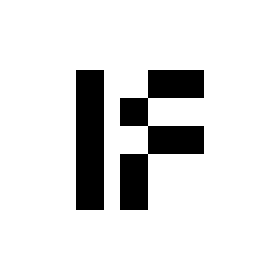
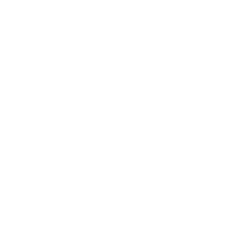
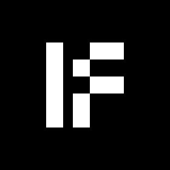
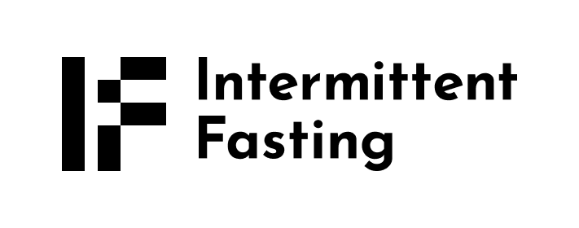
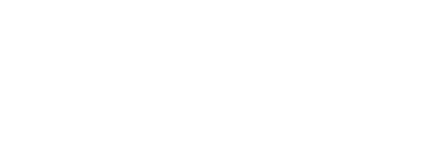
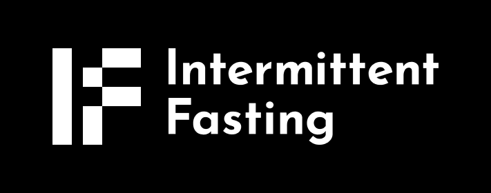

# Brand Kit

<!-- Badge row 1 - status -->

<!-- Badge row 2 - links and profiles -->

<!-- Badge row 3 - detailed status -->

## Brand Guide

### About
**Intermittent Fasting** A Vertical AI Agent Driven by DeSci for Longevity.

## Logos

| Symbol| Symbol transparent background |
| -------------------------------------------------------- | ------------------------------------------------------------------ |
|  |  |
|  |  | 

| Symbol + Wordmark | Symbol + Wordmark transparent background |
| -------------------------------------------------------- | ------------------------------------------------------------------ |
|  |  |
|  |  | 